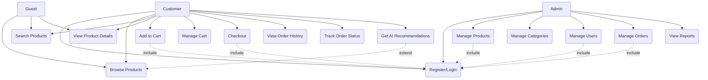
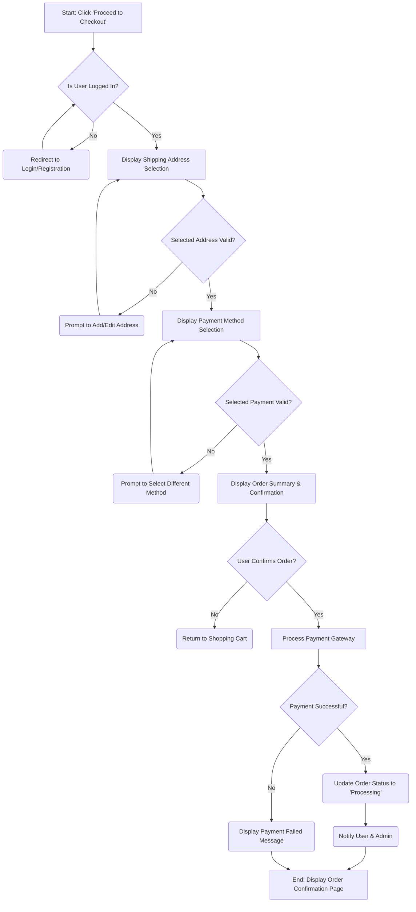

# Session 10: Kỹ năng Prompt để phân tích, xây dựng SRS dự án

## Lesson 05: Thực hành tạo tài liệu SRS với Antigravity

## 1. Mục tiêu học tập
Sau khi hoàn thành bài học này, bạn sẽ có khả năng:
* Hiểu rõ vai trò và cấu trúc của tài liệu đặc tả yêu cầu phần mềm (SRS - Software Requirements Specification).
* Sử dụng AI để phân tích các ý tưởng nghiệp vụ thô của khách hàng và trích xuất danh sách tính năng (Features) và phân quyền (Roles).
* Thiết kế Prompt để AI sinh ra sơ đồ tương tác (Use Case Diagram), sơ đồ luồng dữ liệu (Flowchart) bằng Mermaid và cấu trúc cơ sở dữ liệu (Database Schema) bằng SQL.

---

## 2. Đặt vấn đề thực tế
Hãy tưởng tượng bạn vừa ngồi họp với một đối tác. Họ có một ý tưởng kinh doanh rất lớn: xây dựng một "Hệ thống Cửa hàng Thông minh ứng dụng AI" (AI-Powered Smart Shop System). Khách hàng mô tả rất hào hứng: hệ thống tự động đề xuất sản phẩm dựa trên hành vi người dùng, theo dõi tồn kho tự động bằng camera, tích hợp chatbot AI hỗ trợ khách hàng. 

Tuy nhiên, khi kết thúc buổi họp, tất cả những gì bạn có là một vài dòng ghi chú lộn xộn trong sổ và một mớ ý tưởng rời rạc trong đầu. Làm thế nào để biến những ý tưởng hỗn độn đó thành một bản kế hoạch chi tiết, có cấu trúc mà cả đội phát triển và khách hàng đều hiểu? Làm sao để không bỏ sót bất kỳ yêu cầu quan trọng nào?

---

## 3. Kiến thức cốt lõi

### Vai trò của tài liệu SRS trong dự án phần mềm
SRS (Software Requirements Specification) là tài liệu đặc tả yêu cầu phần mềm, đóng vai trò là "bản thiết kế" và là cam kết pháp lý/kỹ thuật giữa khách hàng, Product Owner và đội ngũ lập trình. Một tài liệu SRS chuẩn giúp đảm bảo các bên có cùng một cách hiểu về hệ thống.

### Quy trình ứng dụng AI để xây dựng tài liệu SRS
* **Phân tích ngữ cảnh:** AI tiếp nhận các mô tả bằng ngôn ngữ tự nhiên để hiểu ý tưởng tổng thể.
* **Trích xuất thông tin:** Tự động lọc ra các thực thể (entities), hành động (actions), vai trò người dùng (roles) và mục tiêu kinh doanh.
* **Cấu trúc hóa dữ liệu:** Sắp xếp các thông tin rời rạc thành danh sách tính năng, phân quyền (RBAC - Role-Based Access Control) và các đặc tả API.
* **Sinh sơ đồ bằng mã nguồn:** Tạo các sơ đồ dạng văn bản như Mermaid (đối với Use Case, Flowchart) hoặc SQL (đối với Database Schema), giúp lập trình viên dễ dàng chỉnh sửa, quản lý phiên bản qua Git và kết xuất ra hình ảnh.

---

## 4. Phân tích tình huống thực tế

### Bối cảnh
Nhóm dự án cần nhanh chóng xây dựng tài liệu SRS cho hệ thống "AI-Powered Smart Shop System" từ những yêu cầu thô ban đầu của khách hàng.

### Thách thức
* Nếu làm thủ công theo cách truyền thống, việc phỏng vấn, tổng hợp và vẽ lại các sơ đồ Use Case, Flowchart bằng công cụ đồ họa sẽ tốn nhiều ngày và dễ xảy ra tình trạng không nhất quán.
* Các bên (Khách hàng, PO, Developer) dễ hiểu sai ý nhau do mô tả bằng văn bản thông thường quá dài và thiếu trực quan.

### Giải pháp với Antigravity
Sử dụng các prompt chuyên biệt theo từng bước để AI tự động phân tích và sinh ra các thành phần kỹ thuật của SRS, sau đó kết xuất sơ đồ dạng Mermaid để làm rõ luồng hoạt động.

---

## 5. Demo minh họa

### Mục tiêu demo
Thực hành viết các Prompt có cấu trúc để phân tích yêu cầu thô và sinh ra các thành phần của tài liệu SRS bao gồm: Features, Roles, Use Case Diagram, Flowchart và Database Schema.

---

### Quy trình 4 bước tạo tài liệu SRS bằng Prompt

#### Bước 1: Prompt phân tích yêu cầu tổng quan và trích xuất Features, Roles
Lập trình viên gửi prompt sau vào Chat Panel:
```text
Context: Bạn là một Chuyên viên Phân tích Nghiệp vụ (Business Analyst) cấp cao. Tôi có một ý tưởng cho hệ thống "AI-Powered Smart Shop System" với các mô tả thô sau:
- Khách hàng có thể đăng ký tài khoản (email, Google, Facebook), đăng nhập, xem danh mục sản phẩm, tìm kiếm sản phẩm theo tên/loại/giá, xem chi tiết sản phẩm (mô tả, ảnh, giá, đánh giá), thêm sản phẩm vào giỏ hàng, cập nhật số lượng trong giỏ, xóa sản phẩm khỏi giỏ.
- Khách hàng thực hiện thanh toán trực tuyến (chọn địa chỉ giao hàng, phương thức thanh toán như Credit Card, PayPal, Momo), xem lịch sử đơn hàng, theo dõi trạng thái đơn hàng.
- Hệ thống có tính năng AI đề xuất sản phẩm dựa trên lịch sử mua hàng và xem sản phẩm của người dùng.
- Quản trị viên (Admin) quản lý sản phẩm (thêm, sửa, xóa), danh mục, quản lý người dùng (xem danh sách, khóa/mở tài khoản), quản lý đơn hàng (cập nhật trạng thái) và xem báo cáo thống kê doanh thu.
- Khách vãng lai (Guest) chỉ có thể xem danh mục và tìm kiếm sản phẩm.

Objective: Vui lòng phân tích các yêu cầu trên và trích xuất:
1. Danh sách các tính năng chính (Features) được phân nhóm rõ ràng.
2. Phân quyền người dùng (Role-Based Access Control) cho từng vai trò: Customer, Admin, Guest.

Constraints: Đầu ra có cấu trúc rõ ràng, sử dụng dấu gạch đầu dòng và tiêu đề con.
```

*Kết quả phân tích từ AI sẽ phân loại rõ ràng các nhóm tính năng (Authentication, Catalog, Cart, Order, Admin Management) và gán quyền chi tiết cho từng đối tượng.*

---

#### Bước 2: Prompt tạo Use Case Diagram (định dạng Mermaid)
Gửi prompt tiếp theo để mô hình hóa tương tác:
```text
Context: Dựa trên danh sách tính năng và phân quyền đã trích xuất ở Bước 1.
Objective: Hãy tạo một Use Case Diagram chi tiết ở định dạng Mermaid cho hệ thống "AI-Powered Smart Shop System".
Constraints:
- Sử dụng cấu trúc biểu đồ graph TD trong Mermaid.
- Định nghĩa rõ các actor: Customer, Admin, Guest.
- Bao gồm các use case chính và các mối quan hệ include/extend nếu có.
- Trả về mã nguồn Mermaid sạch, không chứa ký tự thừa.
```

**Mã nguồn Mermaid do AI sinh ra:**

* **Mô tả hình ảnh:** Sơ đồ Use Case thể hiện tương tác của ba tác nhân (Customer, Admin, Guest) với các chức năng tương ứng của hệ thống.
* **Prompt gợi ý (English):** A clean software architecture use case diagram for an e-commerce platform. Actors are represented on the sides, and the system boundary contains standard use cases. Flat vector art, technical blueprint aesthetic, isolated on a white background.

---

#### Bước 3: Prompt tạo Flowchart cho tính năng cụ thể (Checkout)
Gửi prompt yêu cầu vẽ luồng nghiệp vụ chi tiết cho chức năng thanh toán:
```text
Context: Tôi cần làm rõ luồng xử lý của tính năng "Checkout" (Thanh toán) trong hệ thống.
Objective: Tạo một Flowchart ở định dạng Mermaid minh họa luồng xử lý chi tiết từ khi người dùng click "Proceed to Checkout" cho đến khi hoàn thành hoặc gặp lỗi.
Constraints:
- Thể hiện các bước kiểm tra đăng nhập, chọn địa chỉ, chọn phương thức thanh toán, xác nhận đơn hàng, gọi cổng thanh toán và xử lý kết quả (thành công/thất bại).
- Sử dụng mã Mermaid graph TD rõ ràng.
```

**Mã nguồn Mermaid do AI sinh ra:**


---

#### Bước 4: Prompt thiết kế Database Schema (SQL)
Gửi prompt yêu cầu sinh mã DDL cho cơ sở dữ liệu:
```text
Context: Dựa trên các thực thể và tính năng của hệ thống "AI-Powered Smart Shop System".
Objective: Hãy viết Database Schema cơ bản dưới dạng các câu lệnh SQL CREATE TABLE.
Constraints:
- Bao gồm các bảng: Users, Categories, Products, Carts, CartItems, Orders, OrderItems.
- Khai báo đầy đủ các trường dữ liệu phù hợp, khóa chính (PRIMARY KEY), khóa ngoại (FOREIGN KEY) và các ràng buộc toàn vẹn dữ liệu.
- Định dạng SQL chuẩn, viết hoa từ khóa SQL.
```

**Mã nguồn SQL do AI sinh ra:**
```sql
-- Table: Users
CREATE TABLE Users (
    userId INT PRIMARY KEY AUTO_INCREMENT,
    username VARCHAR(50) UNIQUE NOT NULL,
    passwordHash VARCHAR(255) NOT NULL,
    email VARCHAR(100) UNIQUE NOT NULL,
    role ENUM('CUSTOMER', 'ADMIN') NOT NULL,
    createdAt TIMESTAMP DEFAULT CURRENT_TIMESTAMP,
    updatedAt TIMESTAMP DEFAULT CURRENT_TIMESTAMP ON UPDATE CURRENT_TIMESTAMP
);

-- Table: Categories
CREATE TABLE Categories (
    categoryId INT PRIMARY KEY AUTO_INCREMENT,
    categoryName VARCHAR(100) UNIQUE NOT NULL,
    description TEXT
);

-- Table: Products
CREATE TABLE Products (
    productId INT PRIMARY KEY AUTO_INCREMENT,
    productName VARCHAR(255) NOT NULL,
    description TEXT,
    price DECIMAL(10, 2) NOT NULL,
    stockQuantity INT NOT NULL,
    categoryId INT,
    imageUrl VARCHAR(255),
    createdAt TIMESTAMP DEFAULT CURRENT_TIMESTAMP,
    updatedAt TIMESTAMP DEFAULT CURRENT_TIMESTAMP ON UPDATE CURRENT_TIMESTAMP,
    FOREIGN KEY (categoryId) REFERENCES Categories(categoryId)
);

-- Table: Carts
CREATE TABLE Carts (
    cartId INT PRIMARY KEY AUTO_INCREMENT,
    userId INT UNIQUE NOT NULL,
    createdAt TIMESTAMP DEFAULT CURRENT_TIMESTAMP,
    updatedAt TIMESTAMP DEFAULT CURRENT_TIMESTAMP ON UPDATE CURRENT_TIMESTAMP,
    FOREIGN KEY (userId) REFERENCES Users(userId)
);

-- Table: CartItems
CREATE TABLE CartItems (
    cartItemId INT PRIMARY KEY AUTO_INCREMENT,
    cartId INT NOT NULL,
    productId INT NOT NULL,
    quantity INT NOT NULL,
    priceAtAddToCart DECIMAL(10, 2) NOT NULL,
    FOREIGN KEY (cartId) REFERENCES Carts(cartId),
    FOREIGN KEY (productId) REFERENCES Products(productId)
);

-- Table: Orders
CREATE TABLE Orders (
    orderId INT PRIMARY KEY AUTO_INCREMENT,
    userId INT NOT NULL,
    orderDate TIMESTAMP DEFAULT CURRENT_TIMESTAMP,
    totalAmount DECIMAL(10, 2) NOT NULL,
    shippingAddress TEXT NOT NULL,
    paymentMethod VARCHAR(50) NOT NULL,
    orderStatus ENUM('PENDING', 'PROCESSING', 'SHIPPED', 'DELIVERED', 'CANCELLED') NOT NULL,
    FOREIGN KEY (userId) REFERENCES Users(userId)
);

-- Table: OrderItems
CREATE TABLE OrderItems (
    orderItemId INT PRIMARY KEY AUTO_INCREMENT,
    orderId INT NOT NULL,
    productId INT NOT NULL,
    quantity INT NOT NULL,
    priceAtOrder DECIMAL(10, 2) NOT NULL,
    FOREIGN KEY (orderId) REFERENCES Orders(orderId),
    FOREIGN KEY (productId) REFERENCES Products(productId)
);
```

---

## 6. Tổng kết

### Những kiến thức quan trọng nhất
* Sử dụng AI giúp lập trình viên/Business Analyst tăng tốc độ soạn thảo tài liệu SRS gấp 5-10 lần so với phương pháp thủ công.
* Kết xuất các sơ đồ dưới dạng code (Mermaid, SQL) giúp dễ dàng tích hợp vào file markdown, quản lý phiên bản qua Git và chia sẻ trong đội ngũ phát triển.

### Những sai lầm thường gặp
* **Prompt chung chung, thiếu ngữ cảnh:** Chỉ yêu cầu "Vẽ Use Case cho shop" sẽ khiến AI sinh sơ đồ không sát với phân hệ thực tế của dự án.
* **Không lặp lại và tinh chỉnh:** Coi kết quả đầu tiên của AI là hoàn hảo. Thực tế, cần thực hiện Prompt lặp (Iterative Prompting) để điều chỉnh các nhánh xử lý phụ hoặc các trường thông tin bị thiếu.
* **Tin tưởng tuyệt đối:** Không kiểm tra lại các mối quan hệ khóa ngoại (Foreign Key) hoặc các điều kiện kiểm tra rẽ nhánh, dẫn đến lỗi thiết kế hệ thống từ bước đặc tả.

---

## 7. Câu hỏi đánh giá

### Câu 1
Tại sao việc mô tả sơ đồ Use Case hoặc Flowchart bằng mã nguồn Mermaid lại ưu việt hơn so với việc vẽ bằng các phần mềm đồ họa kéo thả (như Visio, Draw.io) trong quá trình làm việc nhóm?

**Gợi ý đáp án:**
Việc sử dụng mã nguồn Mermaid giúp lưu trữ sơ đồ dưới dạng text trực tiếp trong các tệp markdown của dự án. Điều này giúp dễ dàng quản lý phiên bản bằng Git (xem được lịch sử thay đổi từng dòng), chỉnh sửa nhanh chóng bằng cách sửa text mà không cần mở phần mềm ngoài, và tự động hiển thị sơ đồ trực quan trên các nền tảng hỗ trợ (như GitHub, GitLab, IDE).

### Câu 2
Nêu quy trình 4 bước để chuyển đổi các yêu cầu nghiệp vụ bằng ngôn ngữ tự nhiên của khách hàng thành tài liệu kỹ thuật có cấu trúc thông qua AI.

**Gợi ý đáp án:**
1. Trích xuất Features và Roles/Permissions để phân nhóm chức năng và phân quyền.
2. Thiết lập Use Case Diagram để mô hình hóa sự tương tác của các vai trò với hệ thống.
3. Thiết kế Flowchart cho các luồng xử lý nghiệp vụ phức tạp hoặc có điều kiện rẽ nhánh (như Checkout, Đăng ký).
4. Xây dựng Database Schema dưới dạng SQL DDL để định nghĩa cấu trúc dữ liệu lưu trữ.

### Câu 3
Khi AI sinh ra một Database Schema bằng câu lệnh SQL CREATE TABLE, bạn cần thực hiện những bước kiểm chứng (Verify) nào để đảm bảo tính đúng đắn trước khi sử dụng?

**Gợi ý đáp án:**
1. Kiểm tra tính đúng đắn của kiểu dữ liệu các cột (ví dụ: price dùng DECIMAL thay vì FLOAT/DOUBLE, password dùng VARCHAR đủ dài để lưu hash).
2. Xác minh các ràng buộc khóa ngoại (FOREIGN KEY) đã tham chiếu đúng đến khóa chính (PRIMARY KEY) của bảng gốc chưa.
3. Đảm bảo các ràng buộc toàn vẹn dữ liệu cơ bản (NOT NULL, UNIQUE) đã được áp dụng đúng cho các trường bắt buộc (như email, username).