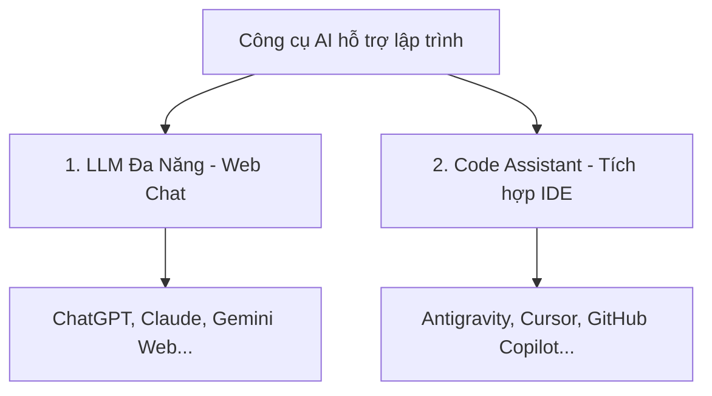

# Session 02: Lợi ích, hạn chế và trách nhiệm khi sử dụng AI

## Lesson 02: Giới thiệu các công cụ AI thông dụng

### 1. Mục tiêu học tập
Sau bài học này, bạn sẽ có khả năng:
* Phân loại được hai nhóm công cụ AI chính: LLM đa năng (General LLM) và Trợ lý lập trình tích hợp (Code Assistant).
* Hiểu rõ cơ chế hoạt động và thế mạnh của từng nhóm công cụ trong quy trình làm việc.
* Lựa chọn và ứng dụng linh hoạt các phím tắt/tiện ích của Code Assistant để chỉnh sửa code trực tiếp trong editor.

---

### 2. Đặt vấn đề thực tế: Sự bất tiện khi liên tục chuyển đổi cửa sổ (Context Switching)
Trong quá trình phát triển tính năng áp mã giảm giá (`validateVoucher`) cho QuickBite, bạn cần chỉnh sửa điều kiện kiểm tra ngày hết hạn của voucher:

```javascript
function validateVoucher(voucher) {
    const today = new Date();
    // Cần sửa: So sánh ngày hết hạn của voucher với ngày hiện tại
    if (voucher.expiryDate < today) {
        return false;
    }
    return true;
}
```
Để thực hiện việc này, ban đầu bạn mở trình duyệt lên, truy cập trang web ChatGPT, sao chép toàn bộ hàm vào ô chat và gõ Prompt: *"Hãy sửa hàm này để so sánh ngày chính xác không tính giờ phút giây"*. ChatGPT trả về đoạn code mới. Bạn sao chép đoạn code mới đó, chuyển tab quay lại editor và dán đè lên code cũ.

Quy trình copy-paste liên tục giữa editor và trình duyệt web khiến bạn mất tập trung, tốn thời gian và dễ xảy ra lỗi dán nhầm dòng code. Làm thế nào để có thể giao tiếp với AI ngay trên giao diện viết code của mình?

> [!NOTE]
> Việc liên tục chuyển đổi ngữ cảnh (Context Switching) giữa các công cụ làm việc là một trong những nguyên nhân hàng đầu làm giảm hiệu suất và sự tập trung của lập trình viên.

---

### 3. Kiến thức cốt lõi: Phân loại các công cụ AI thông dụng

Hiện nay, các công cụ AI hỗ trợ lập trình được chia thành hai nhóm chính:



#### A. Nhóm 1: LLM Đa Năng (General-purpose LLM)
* **Giao diện:** Truy cập qua trình duyệt Web (ChatGPT, Claude, Gemini).
* **Đặc điểm:** Hoạt động theo dạng Chatbox tự do. Không có kết nối trực tiếp với các tệp tin trong máy tính của bạn.
* **Thế mạnh:** Phân tích ý tưởng lớn, giải thích kiến trúc hệ thống, viết tài liệu hướng dẫn, giải thích các khái niệm lý thuyết trừu tượng.

#### B. Nhóm 2: Trợ lý Lập trình tích hợp (Code Assistant)
* **Giao diện:** Tích hợp trực tiếp bên trong trình biên dịch mã nguồn (IDE như VS Code, JetBrains) dưới dạng extension hoặc editor chuyên dụng (như **Antigravity**, Cursor).
* **Đặc điểm:** Có khả năng đọc hiểu toàn bộ thư mục dự án (Workspace Context), tự động điền code (Autocomplete) khi bạn đang gõ, và giao tiếp trực tiếp trên giao diện code.
* **Thế mạnh:** Sinh code nhanh tại chỗ, sửa lỗi cú pháp tức thì, refactor mã nguồn trực tiếp, viết Unit Test nhanh bằng phím tắt.

---

### 4. Thực hành minh họa (Demo): Chỉnh sửa code QuickBite trực tiếp trong IDE
Chúng ta sẽ so sánh hai cách tiếp cận để giải quyết yêu cầu sửa hàm `validateVoucher` ở phần Đặt vấn đề.

#### Cách 1: Sử dụng Web Chat (ChatGPT/Claude)
1. Copy code từ IDE -> Mở Chrome -> Mở ChatGPT.
2. Gõ Prompt và gửi -> Chờ AI trả lời -> Nhấn nút Copy code.
3. Chuyển tab về IDE -> Chọn vùng code cũ -> Paste đè lên.
*👉 Tổng thời gian: ~45 giây. Đòi hỏi nhiều thao tác thủ công.*

#### Cách 2: Sử dụng Code Assistant (như Antigravity/Cursor) trực tiếp tại dòng code
1. Bôi đen đoạn code cần sửa trực tiếp trong IDE.
2. Nhấn tổ hợp phím tắt **Ctrl + K** (hoặc Cmd + K trên macOS) để mở hộp thoại Prompt inline.
3. Gõ yêu cầu ngắn gọn: *"Sửa so sánh ngày hết hạn của voucher không tính giờ phút giây"* và nhấn Enter.
4. AI sẽ hiển thị một bảng so sánh Diff (đỏ là code cũ sẽ xóa, xanh là code mới sẽ thêm vào) ngay tại chỗ:
   ```diff
   - if (voucher.expiryDate < today) {
   + if (new Date(voucher.expiryDate).setHours(0,0,0,0) < today.setHours(0,0,0,0)) {
   ```
5. Nhấn **Accept** (hoặc Ctrl + Enter) để đồng ý áp dụng thay đổi.
*👉 Tổng thời gian: ~10 giây. Không cần chuyển tab, không cần copy-paste thủ công.*

---

### 5. Tổng kết & Đánh giá

## Q1
Sự khác biệt cốt lõi nhất giữa một LLM đa năng chạy trên Web (như ChatGPT Web) và một Code Assistant tích hợp trong IDE (như Antigravity) là gì?

[A]
LLM đa năng chạy trên Web hoàn toàn miễn phí còn Code Assistant tích hợp trong IDE thì bắt buộc phải trả phí rất cao.
[EXP]
Sai. Cả hai nhóm công cụ đều có các phiên bản miễn phí và trả phí tùy thuộc vào nhà cung cấp và nhu cầu sử dụng.
[B]
Code Assistant tích hợp trong IDE có khả năng đọc hiểu ngữ cảnh toàn bộ thư mục dự án (workspace) và cho phép tương tác/sửa code trực tiếp tại chỗ.
[EXP]
Đúng. Đây là lợi thế vượt trội giúp loại bỏ thao tác copy-paste và tăng tốc độ lập trình.
[C]
LLM đa năng chạy trên Web chỉ hiểu được ngôn ngữ tự nhiên còn Code Assistant chỉ hiểu được mã nguồn máy tính.
[EXP]
Sai. Cả hai nhóm đều hiểu tốt cả ngôn ngữ tự nhiên và mã nguồn lập trình.
[D]
Code Assistant tích hợp trong IDE không thể giải thích các lỗi logic phức tạp mà chỉ tự động điền từ (auto-complete).
[EXP]
Sai. Code Assistant tích hợp vẫn giải thích lỗi rất tốt qua các khung chat tích hợp (như Ctrl+L).

@correct: B
@point: 20

## Q2
Trong quy trình làm việc thực tế, khi lập trình viên QuickBite muốn viết một tài liệu mô tả kiến trúc hệ thống (System Architecture Document), công cụ nào dưới đây là phù hợp nhất?

[A]
Tính năng tự động điền code (Inline Autocomplete) của Code Assistant.
[EXP]
Sai. Autocomplete chỉ hỗ trợ sinh nhanh các dòng code ngắn khi đang gõ, không phù hợp để viết tài liệu kiến trúc dài.
[B]
Giao diện chat Web của một LLM đa năng (như Claude hoặc ChatGPT).
[EXP]
Đúng. Giao diện chat web rộng rãi, hỗ trợ định dạng văn bản tốt và phù hợp để thảo luận, biên soạn các tài liệu dài, mang tính chất khái quát.
[C]
Công cụ biên dịch mã nguồn (Compiler/Linter) mặc định của IDE.
[EXP]
Sai. Compiler/Linter chỉ kiểm tra lỗi cú pháp và cảnh báo code xấu, không có khả năng sinh tài liệu kiến trúc.
[D]
Trình mô phỏng thiết bị di động (Emulator) của hệ điều hành Android.
[EXP]
Sai. Emulator dùng để chạy thử ứng dụng Android, không liên quan đến việc viết tài liệu kiến trúc.

@correct: B
@point: 20

## Q3
Hành động nào sau đây sử dụng phím tắt hiệu quả nhất khi muốn tối ưu hóa một hàm kiểm tra giỏ hàng bằng Code Assistant?

[A]
Copy toàn bộ file code, mở trình duyệt, dán vào ChatGPT và yêu cầu tối ưu, sau đó copy ngược lại.
[EXP]
Sai. Cách này thủ công và tốn thời gian chuyển đổi cửa sổ làm việc.
[B]
Bôi đen hàm cần tối ưu, nhấn tổ hợp phím chỉnh sửa inline (như Ctrl+K), nhập yêu cầu tối ưu và nhấn Accept sau khi xem xét bản Diff.
[EXP]
Đúng. Giúp tối ưu hóa code trực tiếp tại chỗ một cách nhanh chóng và an toàn nhờ giao diện hiển thị trực quan.
[C]
Gõ lại toàn bộ hàm bằng tay theo một cú pháp khác rồi chạy Linter để xem Linter có tự sửa lỗi hay không.
[EXP]
Sai. Linter chỉ báo lỗi cú pháp hoặc định dạng, không tự động tối ưu hóa thuật toán nghiệp vụ phức tạp.
[D]
Mở khung chat của IDE (Ctrl+L), yêu cầu AI giải thích lại toàn bộ dự án từ đầu để tự tìm cách viết lại.
[EXP]
Sai. Cách này quá gián tiếp và tốn thời gian khi mục tiêu cụ thể chỉ là tối ưu hóa một hàm đơn lẻ.

@correct: B
@point: 20
